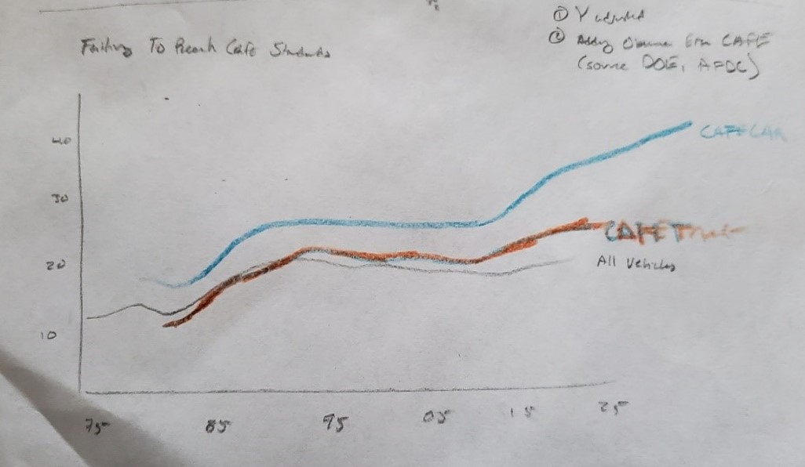

# Portfolio

This page will hold my publicly available visualizations and critiques for the class.
See each week below to check out my visualizations!

## Week 1

### Visualization Critique #1: The Economist

Original Image from The Economist vs. Personal Critiques

  

<a href="https://github.com/jcboyle2/Boyle-Portfolio/blob/master/JohnBoyle_Critique%20%231_Economist_bar_chart.xlsx?raw=true">Download a written copy of the critique (.xlsx), which explains the decisions in the image above.</a>

### Other Critiques from The Good Charts Workbook

<b>Comparing How We Spend Our Time</b>

<b>Interest In Buying A Drone, Total</b>

<b>Interest In Buying A Drone, Under 30</b>

## Week 2

Below is the data critique from The Economist in week 1, re-visualized using Datawrapper!

<iframe title="Brazil's Growing Pension Problem" aria-label="chart" id="datawrapper-chart-wsU57" src="https://datawrapper.dwcdn.net/wsU57/1/" scrolling="no" frameborder="0" style="width: 0; min-width: 100% !important; border: none;" height="400"></iframe>

### DataViz 2: Working with Web-Based Visualization Tools and Data

<b>General Government Debt (Total, % of GDP) - OECD Countries, 2017</b>
<iframe src="https://data.oecd.org/chart/61Cj" width="640" height="480" style="border: 0" mozallowfullscreen="true" webkitallowfullscreen="true" allowfullscreen="true"><a href="https://data.oecd.org/chart/61Cj" target="_blank">OECD Chart: General government debt, Total, % of GDP, Annual, 2017</a></iframe>

<b>General Government Debt (Total, % of GDP) - OECD Countries, 1995-2019</b>

<b>Version 1: Tufte's Sparklines Re-Creation</b>

<b>Version 2: Animated Rank Chart, using Flourish Templates</b>

## Week 3

<noscript>

</noscript>
<object class='tableauViz'  style='display:none;'>
<param name='host_url' value='https%3A%2F%2Fpublic.tableau.com%2F' />
<param name='embed_code_version' value='3' />
<param name='site_root' value='' />
<param name='name' value='TellingStoriesWData1&#47;Sheet1' />
<param name='tabs' value='no' />
<param name='toolbar' value='yes' />
<param name='static_image' value='https:&#47;&#47;public.tableau.com&#47;static&#47;images&#47;Te&#47;TellingStoriesWData1&#47;Sheet1&#47;1.png' />
<param name='animate_transition' value='yes' />
<param name='display_static_image' value='yes' />
<param name='display_spinner' value='yes' />
<param name='display_overlay' value='yes' />
<param name='display_count' value='yes' />
<param name='language' value='en' />
</object>

### Assignment 3 & 4: Critique by Design

#### Original Visualization
Below is the original graphic created by the U.S. Environmental Protection Agency in 2019, examining the record increases in fuel efficiency standards and the record lows of CO2 emissions.

I chose this image for three reasons. First, the truncated y-axis on both obscures the reality of the gains made in fuel efficiency and CO2 emissions. Yes they are records for the United States, historically one of the worst carbon emittors on the planet, and we should celebrate the progress. But this should be done honestly, and without obfuscation. 

Second, this visualization does not show the any of the mileage goals that we have set for ourselves. Any discussion of increased mileage standards should at least how the progress is nowhere near the CAFE (Corporate Average Fuel Economy) Standard goals we set for ourselves in 1975.

Third, I think that this graph could do a better job of showing the relationship between fuel efficiency standards and emissions. The EPA shows the two charts stacked on top of each other because they do not fit the same y-axis scale. Instead of stacking them - of making a two y-axis chart - you could instead compare percent changes by year.

In doing this chart, I thought most of it was declarative and data-driven with a little bit of exploratory data driven to make sure the data fit the designs I had in mind. Ultimately this exploratory part didn't take place until after I recieved feedback from my partners, but I anticipated it based on the my first hand drawn sketches.

#### From Wireframe to Visualization

I believe that part of the reason for this visualization is for the current administration to show that they are making climate progress without adequately addressing climate issues, or at worst, muddy the waters of scientific debate by showing charts that are favorable to climate denial. With that in mind, I knew I wanted to take the simple charts and make one version with a clean, unadjusted y-axis, and another version diving deeper into the data. After all, these were my biggest complaints from the original data critique. I thought that the original visualization did a great job of being simple, clean, and clearly stating the data they chose to use. My problem was that of the contextual awareness outside the data.

 

Those proved to be simple line charts, as they are a single variable sketched over the same period of time. I did clean the handmade sketches in Excel for feedback because my ability to draw is limited, even in this context. I tried to reduce the wording of the axis labels and making the titles a little more interesting - however the feedback I had received during the wireframing led me to abandon my titles. Although I felt they better described the data, my second feedback partner said that I had editorialized it to much. While the original wasn't memorable, I should still leave room for the reader to come up with their own conclusions. I had referred to the increased MPG standards as plateau-ing, but my reader thought there was enough improvement overall, and I was discounting that to make my own point. Whereas I thought the current administration had politized the data one way, I was doing the same in the opposite. In the end, I think the data is more honest in my chart, but I still decided to change the title for the final visualization.

 

 

For the second fuel efficiency visualization, I couldn't decided if I wanted to measure the difference between cars and trucks, or show the failings of meeting CAFE Standards. I ultimately settled on combining and cleaning the two, and dropping the use of the legislative phrase "CAFE Standards" as neither of my feedback partners knew what that was. Instead, I referred to CAFE Standards as goals, as they are functionally the same in this context. By combining the two charts, this solved my problem of split data. CAFE Standards are set by vehicle type (car/truck), whereas this data was originally looking at all vehicles. By focusing only on "car MPG vs. car goal MPG" and "truck MPG vs. truck goal MPG" I was able to get a cleaner, more understandable chart. This also allowed me my first chance to use some colors. My initial wireframes accidentially used different colors for the same variables, so I kept everything to gray (all vehicles), blue (cars), and orange (trucks) for this. I also used some texture by making the goal MPG lines dashed, and a slightly lighter shade, to separate the two. This clearly shows how even though MPG standards have increased, there is an ever growing gap between previously established goals and current MPG levels. Even though this data involved getting another source (U.S. Department of Energy's Alternative Fuel Data Center), it is still government agency data that is widely available.

 

When looking at the first CO2 emissions chart, the changes made here were roughly the same as the first MPG chart - an unadjusted y-axis and better titles. Again, I fee like this is a more accurate representation of the original data.

 

For the second chart of the CO2 emissions chart, I wanted to show the relationship between fuel efficiency and emissions. I feel like this is what the original was trying to do without actually making the comparison clear - because that would show how humans contribute to climate change. Originally I wanted to make a two-axis chart of straight MPG to C02 emissions, but that proved to be confusing to my feedback partners. By setting it to an indexed chart, I believe this shows how it is almost one-to-one, when fuel efficiency increases the CO2 emissions of vehicles decreases. Feedback also helped me pick colors that are different from each other, and from the second MPG chart - which was an issue in the wireframe.

Overall, I think this exercise helped me take the visualization critique to the next level. It is easy to pick apart another person's visualizations, but it is just as easily to make your own mistakes. Talking through and hearing others opinions greatly helped me make better decisions in titles, plotting, and colors.

#### Final Visualizations

<iframe title="Average Fuel Efficiency (MPG) for All Vehicles in the U.S." aria-label="Interactive line chart" id="datawrapper-chart-d921x" src="https://datawrapper.dwcdn.net/d921x/3/" scrolling="no" frameborder="0" style="width: 0; min-width: 100% !important; border: none;" height="400"></iframe>

<iframe title="Comparing Real Fuel Efficiency to MPG Goals by Vehicle Type" aria-label="Interactive line chart" id="datawrapper-chart-OqEhQ" src="https://datawrapper.dwcdn.net/OqEhQ/3/" scrolling="no" frameborder="0" style="width: 0; min-width: 100% !important; border: none;" height="480"></iframe>

<iframe title="Examining the Decline of U.S. CO2 Emissions Over Time" aria-label="Interactive line chart" id="datawrapper-chart-IxhZL" src="https://datawrapper.dwcdn.net/IxhZL/1/" scrolling="no" frameborder="0" style="width: 0; min-width: 100% !important; border: none;" height="480"></iframe>

<iframe title="The Relationship Between Increased Fuel Efficiency Standards and Decreased C02 Emissions" aria-label="Interactive line chart" id="datawrapper-chart-YOjkV" src="https://datawrapper.dwcdn.net/YOjkV/1/" scrolling="no" frameborder="0" style="width: 0; min-width: 100% !important; border: none;" height="480"></iframe>

## Week 4

## Week 5

## Mini Project
