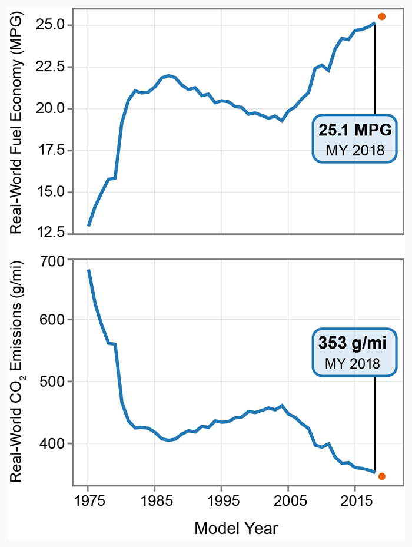
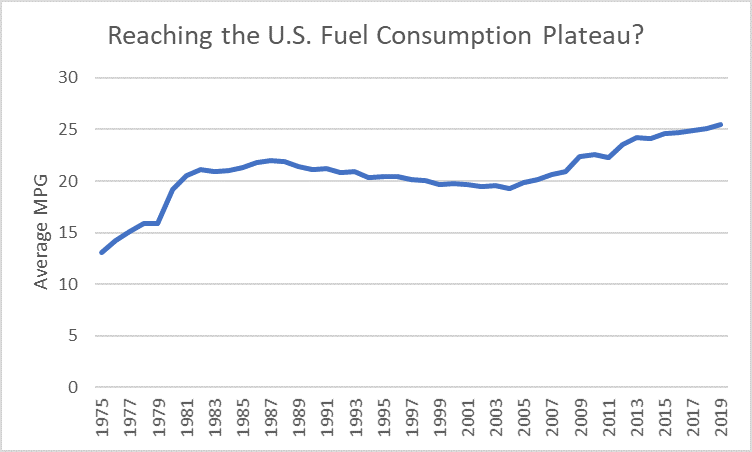
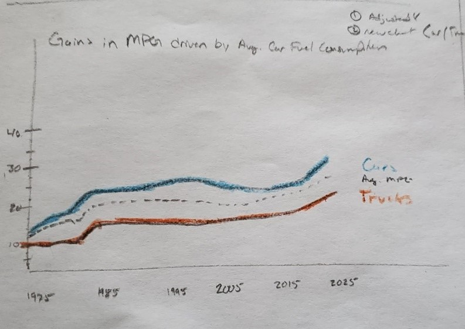
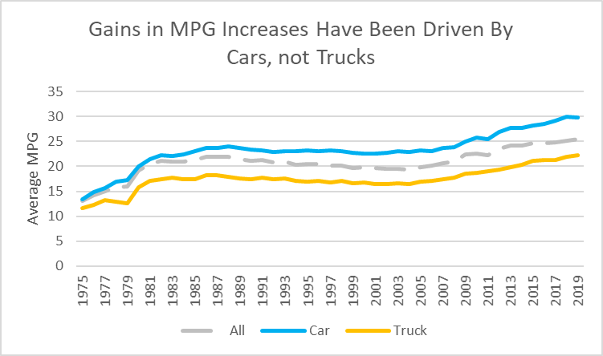
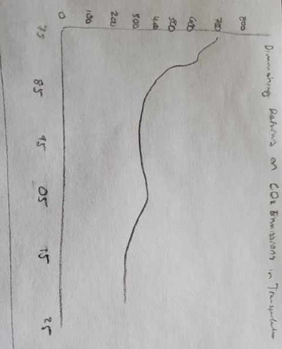
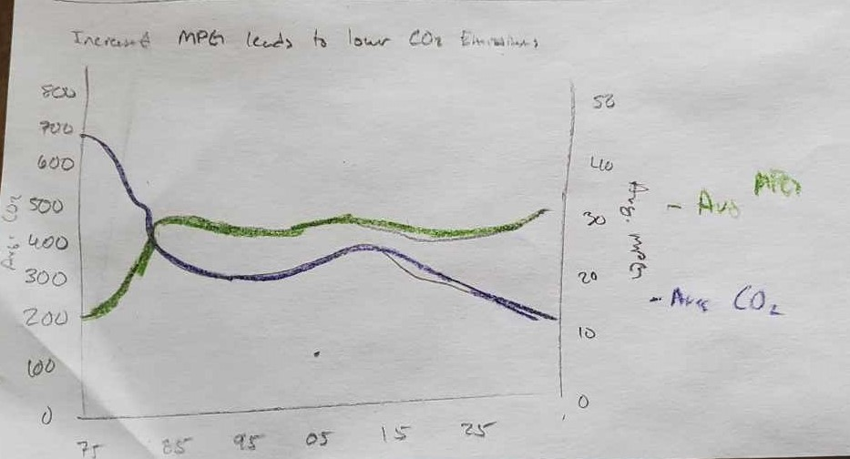

<html>
<head>
<meta name="viewport" content="width=device-width, initial-scale=1">

</head>
<body>

<h1>Portfolio</h1>
This page will hold my publicly available visualizations and critiques for the class.
 
 

Check below for the collapsible menu of each week's assignments!

<button type="button" class="collapsible">Open Week 1</button>

<h2>Week 1: Controlling for Color</h2>
  <button type="button" class="collapsible">Visualization Critique #1</button>
  

  

    <h3>Visualization Critique #1: The Economist</h3>
     
    Original Image from The Economist vs. Personal Critiques
     
      
     
    <a href="https://github.com/jcboyle2/Boyle-Portfolio/blob/master/JohnBoyle_Critique%20%231_Economist_bar_chart.xlsx?raw=true">Download a written copy of the critique     (.xlsx), which explains the decisions in the image above.</a>
  

  

<button type="button" class="collapsible">Other Critiques and Redesigns from the Good Charts Workbook</button>
  

  

  <h3> Other Critiques from The Good Charts Workbook</h3>
   
  <b>Comparing How We Spend Our Time</b>
   
  
   
  <b>Interest In Buying A Drone, Total</b>
   
  
   
  <b>Interest In Buying A Drone, Under 30</b>
   
  
  

  

<button type="button" class="collapsible">Open Week 2</button>

  <h2>Week 2:Chart Elements, Hierarchy, Ordering, and More</h2>
   
  <button type="button" class="collapsible">Data Visualization: OECD Country Government Debt</button>
  

  

  <h3>DataViz 2: Working with Web-Based Visualization Tools and Data</h3>
  <b>General Government Debt (Total, % of GDP) - OECD Countries, 2017</b>
  <iframe src="https://data.oecd.org/chart/61Cj" width="640" height="480" style="border: 0" mozallowfullscreen="true" webkitallowfullscreen="true" allowfullscreen="true"><a  href="https://data.oecd.org/chart/61Cj" target="_blank">OECD Chart: General government debt, Total, % of GDP, Annual, 2017</a></iframe>
   
   
  <b>General Government Debt (Total, % of GDP) - OECD Countries, 1995-2019</b>
   
  <b>Version 1: Tufte's Sparklines Re-Creation</b>
  

   
In the chart above, we are examining the Debt-to-GDP ratio of each OECD Country from 1995 to 2019. The Debt-to-GDP ratio ranges from as low as 6.6% in Estonia (2001) to a high of 238.7% in Japan (2018). As you may notice, not every country has data available for each year reported. By looking at this chart you can see which countries were most impacted by the 2008 Financial Crisis (like Greece, Spain, and the United States), which were relatively unaffected (like Norway, Poland, and Sweden).
   
   
  <b>Version 2: Animated Rank Chart, using Flourish Templates</b>
  

   
    This chart, similar to the previous, examines each country individually by animating through each country's available data. My original plan was to make the color gray on the "All Countries" slide, and highlightable with mouse hovering. However, I was not able to achieve this without using CSS (which is not available to a free account holder). Where I think this is more helpful than the second is that the charts are bigger and therefore the trends are little more clear. When you look at the grid of lines chart, it is cool to see all the ratios close, but it can be hard to judge what is happening in each individual country.
 
I tried to focus on making this chart as simple as possible. The two colors, light blue and gray, are picked from the OECD logo. They seem to fit together well. The animation plays through in alphabetical order to show how each country differs from the last. A linear trendline is added to each chart to show how the Debt-to-GDP ratio has changed throughout the course of the 25 year period. This was my third attempt at getting a clear visualization from Flourish. Originally I wanted to use the world map graph, but I struggled to get the available data to fit their model. My second attempt was to make a box plot for each country, to see if there were any outliers in the data, but this proved to not fit as well. This final attempt began as a connected dot-plot that turned into this animated dot-plot, connecting each country by year.
 
If I were to take this a step further, I would add to the data an average debt-to-GDP ratio for each country to sort the data. Currently sorting by debt-to-GDP will mess with the make the line tracing the dots go by the years of highest ratios, not by year (so the lines for Japan would connect from 2018 -> 2014 -> 2015 -> ... -> 1995 instead of sequentially). Secondly, I would add a region specific tag in order to add another area of potential color. An example would be to compare European countries to South American countries to examine the effect of the 2008 Financial Crisis.

<button type="button" class="collapsible">Redoing Week 1's Critique in Datawrapper</button>
  

  

  Below is the data critique from The Economist in week 1, re-visualized using Datawrapper!
   
  <iframe title="Brazil's Growing Pension Problem" aria-label="chart" id="datawrapper-chart-wsU57" src="https://datawrapper.dwcdn.net/wsU57/1/" scrolling="no" frameborder="0" style="width: 0; min-width: 100% !important; border: none;" height="400"></iframe>
  

  

<button type="button" class="collapsible">Open Week 3</button>

  <h2>Week 3</h2>
   
  <h2>Assignment 3 & 4: Critique by Design
   
<h3> Original Visualization</h3>
Below is the original graphic created by the U.S. Environmental Protection Agency in 2019, examining the record increases in fuel efficiency standards and the record lows of CO2 emissions.
 
 

 
 
I chose this image for three reasons. First, the truncated y-axis on both obscures the reality of the gains made in fuel efficiency and CO2 emissions. Yes they are records for the United States, historically one of the worst carbon emittors on the planet, and we should celebrate the progress. But this should be done honestly, and without obfuscation. 
 
 
Second, this visualization does not show the any of the mileage goals that we have set for ourselves. Any discussion of increased mileage standards should at least how the progress is nowhere near the CAFE (Corporate Average Fuel Economy) Standard goals we set for ourselves in 1975.
 
 
Third, I think that this graph could do a better job of showing the relationship between fuel efficiency standards and emissions. The EPA shows the two charts stacked on top of each other because they do not fit the same y-axis scale. Instead of stacking them - of making a two y-axis chart - you could instead compare percent changes by year.
 
 
In doing this chart, I thought most of it was declarative and data-driven with a little bit of exploratory data driven to make sure the data fit the designs I had in mind. Ultimately this exploratory part didn't take place until after I recieved feedback from my partners, but I anticipated it based on the my first hand drawn sketches.
 
 

 
 
<h3> From Wireframe to Visualization </h3>
 
 
I believe that part of the reason for this visualization is for the current administration to show that they are making climate progress without adequately addressing climate issues, or at worst, muddy the waters of scientific debate by showing charts that are favorable to climate denial. With that in mind, I knew I wanted to take the simple charts and make one version with a clean, unadjusted y-axis, and another version diving deeper into the data. After all, these were my biggest complaints from the original data critique. I thought that the original visualization did a great job of being simple, clean, and clearly stating the data they chose to use. My problem was that of the contextual awareness outside the data.
 
 
 
 
 
Those proved to be simple line charts, as they are a single variable sketched over the same period of time. I did clean the handmade sketches in Excel for feedback because my ability to draw is limited, even in this context. I tried to reduce the wording of the axis labels and making the titles a little more interesting - however the feedback I had received during the wireframing led me to abandon my titles. Although I felt they better described the data, my second feedback partner said that I had editorialized it to much. While the original wasn't memorable, I should still leave room for the reader to come up with their own conclusions. I had referred to the increased MPG standards as plateau-ing, but my reader thought there was enough improvement overall, and I was discounting that to make my own point. Whereas I thought the current administration had politized the data one way, I was doing the same in the opposite. In the end, I think the data is more honest in my chart, but I still decided to change the title for the final visualization.
 
 
 
 
 
 
 
 
For the second fuel efficiency visualization, I couldn't decided if I wanted to measure the difference between cars and trucks, or show the failings of meeting CAFE Standards. I ultimately settled on combining and cleaning the two, and dropping the use of the legislative phrase "CAFE Standards" as neither of my feedback partners knew what that was. Instead, I referred to CAFE Standards as goals, as they are functionally the same in this context. By combining the two charts, this solved my problem of split data. CAFE Standards are set by vehicle type (car/truck), whereas this data was originally looking at all vehicles. By focusing only on "car MPG vs. car goal MPG" and "truck MPG vs. truck goal MPG" I was able to get a cleaner, more understandable chart. This also allowed me my first chance to use some colors. My initial wireframes accidentially used different colors for the same variables, so I kept everything to gray (all vehicles), blue (cars), and orange (trucks) for this. I also used some texture by making the goal MPG lines dashed, and a slightly lighter shade, to separate the two. This clearly shows how even though MPG standards have increased, there is an ever growing gap between previously established goals and current MPG levels. Even though this data involved getting another source (U.S. Department of Energy's Alternative Fuel Data Center), it is still government agency data that is widely available.
 
 
 
 
 
When looking at the first CO2 emissions chart, the changes made here were roughly the same as the first MPG chart - an unadjusted y-axis and better titles. Again, I fee like this is a more accurate representation of the original data.
 
 
 
 
 
For the second chart of the CO2 emissions chart, I wanted to show the relationship between fuel efficiency and emissions. I feel like this is what the original was trying to do without actually making the comparison clear - because that would show how humans contribute to climate change. Originally I wanted to make a two-axis chart of straight MPG to C02 emissions, but that proved to be confusing to my feedback partners. By setting it to an indexed chart, I believe this shows how it is almost one-to-one, when fuel efficiency increases the CO2 emissions of vehicles decreases. Feedback also helped me pick colors that are different from each other, and from the second MPG chart - which was an issue in the wireframe.
 
 
Overall, I think this exercise helped me take the visualization critique to the next level. It is easy to pick apart another person's visualizations, but it is just as easily to make your own mistakes. Talking through and hearing others opinions greatly helped me make better decisions in titles, plotting, and colors.
 
 
<h3> Final Visualizations </h3>
 
<iframe title="Average Fuel Efficiency (MPG) for All Vehicles in the U.S." aria-label="Interactive line chart" id="datawrapper-chart-d921x" src="https://datawrapper.dwcdn.net/d921x/3/" scrolling="no" frameborder="0" style="width: 0; min-width: 100% !important; border: none;" height="400"></iframe>
 
<iframe title="Comparing Real Fuel Efficiency to MPG Goals by Vehicle Type" aria-label="Interactive line chart" id="datawrapper-chart-OqEhQ" src="https://datawrapper.dwcdn.net/OqEhQ/3/" scrolling="no" frameborder="0" style="width: 0; min-width: 100% !important; border: none;" height="480"></iframe>
 
<iframe title="Examining the Decline of U.S. CO2 Emissions Over Time" aria-label="Interactive line chart" id="datawrapper-chart-IxhZL" src="https://datawrapper.dwcdn.net/IxhZL/1/" scrolling="no" frameborder="0" style="width: 0; min-width: 100% !important; border: none;" height="480"></iframe>
 
<iframe title="The Relationship Between Increased Fuel Efficiency Standards and Decreased C02 Emissions" aria-label="Interactive line chart" id="datawrapper-chart-YOjkV" src="https://datawrapper.dwcdn.net/YOjkV/1/" scrolling="no" frameborder="0" style="width: 0; min-width: 100% !important; border: none;" height="480"></iframe>

<button type="button" class="collapsible">Open Week 4</button>

  <h2>Week 4</h2>
  Check back soon for Week 4's assignments!

<button type="button" class="collapsible">Open Week 5</button>

  <h2>Week 5</h2>
  Check back soon for Week 5's assignments!

<button type="button" class="collapsible">Open Mini Project</button>

  <h2>Mini Project</h2>
  Check back soon for the Mini Project's benchmark assignments!

</body>
</html>
