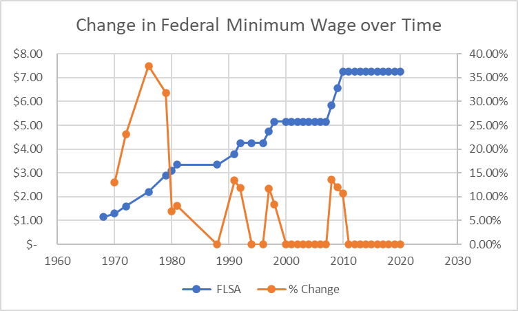

# Mini Project - Final Story

## Project Summary

#### Introduction and Outline:

As housing costs have steadily risen over the past 40 years, the earnings for minimum wage workers haven't matched those increased cost of living. Now, in 2020, no state is affordable to a minimum wage earner, and in some states not even affordable to the average wage earner. This project will examine potential wage and housing policy solutions, as well as what you can do to help in your community.

The general outline of the project will go as follows:

    1. Examining housing costs ->
    2. Looking at what is considered affordable housing ->
    3. History of the federal minimum wage ->
    4. Looking at differences in state minimum wages ->
    5. Example of how all states are unaffordable at minimum wages ->
    6. Considering affordability in the context of average wages ->
    7. Example of how some states are unaffordable to the average workers' wage ->
    8. Recommendations and call to action

#### Wireframe:

#### Method and Medium:

The project will be presented through a [Shorthand site](https://carnegiemellon.shorthandstories.com/the-unaffordable-american-dream/index.html) and will be online.

#### Data Sources:

All data in this project is publicly avaliable, made by U.S. federal agencies. This includes:

 - [1] [U.S. Bureau of Labor Statisitics - Characteristics of Minimum Wage Workers](https://www.bls.gov/opub/reports/minimum-wage/2019/home.htm)
 - [2] [U.S. Department of Labor - Minimum Wage History](https://www.dol.gov/agencies/whd/state/minimum-wage/history)
 - [3] [U.S. Department of Housing and Urban Development - Fair Market Rent History](https://www.huduser.gov/portal/datasets/fmr.html#history)
 - [4] [U.S. Department of Labor - Median Weekly Earnings of Full Time Workers](https://www.bls.gov/webapps/legacy/cpswktab3.htm)
 - [5] [U.S. Bureau of Labor Statistics - Occupational Employment Stats](https://www.bls.gov/oes/current/oessrcst.htm)

[1] Characteristics of Minimum Wage Workers - used to describe the general characteristics of workers, mostly to correct misconceptions about minimum wage workers. Most minimum wage earners are above the age of the age of 25, and have at least a high school diploma.

[2] Minimum Wage History - used to create charts related to minimum wage history over time, and current values of state minimum wages. Anything that references minimum wage levels references these tables.

[3] Fair Market Rent History - used to create anything related to mapping average rent values for apartments in the U.S. This includes both creating a national average, state average, and county level (using FIPS) data, and dates back to 1983. Fair Market Rent is calculated by HUD, and is available for 0, 1, 2, 3, and 4 bedroom apartments. Recent analysis of affordable housing tend to focus on the 2-bedroom apartments as the benchmark.

[4] Median Weekly Earnings - currently not being used in the wireframe, but may be informative in explaining the gap between earnings and affordable housing.

[5] Occupational Employment Stats - Hourly/monthly/annually wage data for each state from May 2019. Used to compare against the affordablility wage calculated with FMR history data.

## Project Design and User Research

#### Original Sketches:

Federal Minimum Wage History:

Average 2-Bedroom Fair Market Rent History Sketch:

State Minimum Wage Difference Sketch:

Map of Affordability Sketch:

#### User Research Protocol and Findings:

My target audience, both for the presentation and for interviewees, are middle-class, educated people who are less likely to have worked a minimum wage job (outside of high school/college) or have lived the effects of poverty. This audience, I believe, would be most impacted by learning about the challenges of some of the most vulnerable Americans and would have the means to make a difference in their community.

Of the interview targets I identified, here are the questions I asked them:

    1.	How familiar are you with the minimum wage? Affordable housing?
    2.	An individual working a full time minimum wage job makes roughly $15k a year. Do you think that is above or below the poverty line? (it is above - $12,760)
    3.	What characteristics would you use to describe a minimum wage worker?
    4.	What do you think is the average fair market rent for a two bedroom apartment is in your state/nationwide? (read figure to them)
    5.	Do you think that is affordable? If not,
    a.	If you could quantify the cost of affordable housing what would it be?
    6.	Show draft visualizations – ask what the like/dislike, if confusing, etc.
    7.	Ask what policies would they be willing to support to address housing affordability issues.

What I found was that my interviewees were aware of what the minimum wage was in their area, but were not aware of what that meant in terms of monthly/annual salary and housing costs. Similarily they were not able to put that in context of the federal poverty line, or what would constitute affordable housing. They seemed less interested in the characteristics of the minimum wage workers and instead the context of average workers within a state. This caused me to rework a lot of the second half framework. I kept the basic history charts as I thought those were simple and clean, and necessary for educating people who may not know more of the details in wage/housing policy. Instead of using the state/federal difference chart from the framework - I made it a map in tableau which was a more efficient use of space and data for my site.

From there, I added to the inforgraphic in the wireframe - an example of affordability applied to the state of Wisconsin. From there, I decided to change the map to a range plot showing the gap between each state's minimum wage and the affordability wage to highlight how big the gap is in every state. Because some of my interviewee's were more interested in the population as a whole, I found data from the U.S. Bureau of Labor Statistics' Occupational Employment Stats, which had each states median and average hourly wage for all workers. I used this to make a second range plot to show that some states are still unaffordable even for the average worker's median wage.

Overall, I felt it made my presentation stronger to be able to point to states where it is unaffordable for the average of all workers, and not just the small fraction of minimum wage workers.

#### Revised Design:

Based on my interviews, I was able to slightly change the scope of my project to include average wage workers, and I was able to clean up some of the less intuitive charts from my sketching.

Map of State Minimum Wages:

<noscript></noscript><object class='tableauViz'  style='display:none;'><param name='host_url' value='https%3A%2F%2Fpublic.tableau.com%2F' /> <param name='embed_code_version' value='3' /> <param name='site_root' value='' /><param name='name' value='MinimumWagebyState_15958742828010&#47;Sheet1' /><param name='tabs' value='no' /><param name='toolbar' value='yes' /><param name='static_image' value='https:&#47;&#47;public.tableau.com&#47;static&#47;images&#47;Mi&#47;MinimumWagebyState_15958742828010&#47;Sheet1&#47;1.png' /> <param name='animate_transition' value='yes' /><param name='display_static_image' value='yes' /><param name='display_spinner' value='yes' /><param name='display_overlay' value='yes' /><param name='display_count' value='yes' /><param name='language' value='en' /></object>

Minimum Wage Affordability Chart:
<iframe title="No State Has Affordable Housing" aria-label="Range Plot" id="datawrapper-chart-qDIRF" src="https://datawrapper.dwcdn.net/qDIRF/5/" scrolling="no" frameborder="0" style="border: none;" width="595" height="1029"></iframe>

Average Wage Affordability Chart:
<iframe title="Affordability is a Mixed Bag" aria-label="Range plot" id="datawrapper-chart-PfQK0" src="https://datawrapper.dwcdn.net/PfQK0/3/" scrolling="no" frameborder="0" style="border: none;" width="595" height="1029"></iframe>

## Final Data Story

#### Intended Audience:

The final intended audience will stay the same for this presentation - primarily middle-class, educated individuals. Through the interviews I conducted, this audience was *aware* of minimum wage and housing costs, but they were shocked and surprised to learn the true extent of unaffordability in the United States. Although they were receptive to the original message, the interviewees pushed me to better understand my audience and expand the scope of the original project beyond just minimum wage earners. In this way, my audience had a better understanding of what made a compelling argument than what I had originally envisioned.

Moving forward, I believe that this audience, with the right messaging, would be willing to reach out to their elected officials, and potentially regular people within their community to push for change. Because of this, I included links in the website that would direct readers to find all their local, state, and federal representatives, how to find where public meetings are in their area, and ways to contact likeminded voters in their community. That last action point is one that has proven to be effective in organizing before the pandemic, and given the difficulties of organizing now, could be extremely beneficial in the short term.

#### Work Summary:

This project proved to be interesting in that what I thought was relatively straightforward proved to take me down many paths. For starters, the general concept didn't change much, but the more data I found the more compelling a story I thought I could tell. By combining multiple datasets (Department of Labor minimum wage statitics with Department of Housing and Urban Development Fair Market Rent data) I was able to make better visualizations than just looking at a single dataset. This also pushed me to better use programs like R Studio for data aggregation and cleaning, especially with the Fair Market Rent state averages. I also was able to use excel to calculate the affordability wages from this by dividing the Fair Market Rent data by (4 weeks * 40 hours * 0.3 for affordability). A lot of the data for this presentation was referenced in news stories, but not provided in tables, and so being able to scrap and recreate a lot of that information was helpful for me.

The turning point for this project came when I first showed my work to my interviewees. Before I had done that, I had felt like I had a good foundation to tell a story, but not a complete story to tell. Their feedback led me to look into the Occupational Employment and Wage Estimates to see how affordable things were for the average worker in each state. This required, again more data scraping, more aggregation, and more computation - but I think without this, I wouldn't have the story necessary to make a difference.

#### Shorthand Link:

Shorthand Link: [The Unaffordable American Dream](https://carnegiemellon.shorthandstories.com/the-unaffordable-american-dream/index.html)

#### Other Reference Material:

<a href="https://github.com/jcboyle2/Boyle-Portfolio/blob/master/FY20_4050_FMRs_rev.xlsx?raw=true">Download raw FY20 FMRs pulled from HUD. (.xlsx)</a>

<a href="https://github.com/jcboyle2/Boyle-Portfolio/blob/master/affordable_wages_per_state_average.xlsx?raw=true">Download computed average affordable wage per hour based on FMR 2-bedroom apartment, compared to minimum/median wage of state. (.xlsx)</a>

<a href="https://github.com/jcboyle2/Boyle-Portfolio/blob/master/average_fair_market_rent.xlsx?raw=true">Download computed average FMR for each state(.xlsx), which explains the decisions in the image above.</a>

<a href="https://github.com/jcboyle2/Boyle-Portfolio/blob/master/wage_fmr_over_time.xlsx?raw=true">Download compiled history of federal minimum wage and FMR over time. (.xlsx)</a>

[1] Source: [CBS News - "The Federal Minimum Wage Sets a Record - For Not Rising"](https://www.cbsnews.com/news/federal-minimum-wage-sets-record-for-length-with-no-increase/)

[2] Source: [USDA - SNAP Eligibility](https://www.fns.usda.gov/snap/recipient/eligibility)

[3] Source: [National Low Income Housing Coalition, 2020](https://reports.nlihc.org/oor/about)

[4] Photo Source: [Wikipedia Commons, Pittsburgh View from the Incline](https://commons.wikimedia.org/wiki/File:Pittsburgh_view-from-incline_sm.jpg)

[5] Photo Source: [White House Archives, President Barack Obama and First Lady Michelle Obama Tour the Columbia Parc Housing Development in New Orleans](https://obamawhitehouse.archives.gov/press-60)

[6] Photo Source: [Andrea Piacquadio, Woman Working as a Cashier, Pexels Free Stock Photos](https://www.pexels.com/photo/woman-working-as-a-cashier-3801439/)
