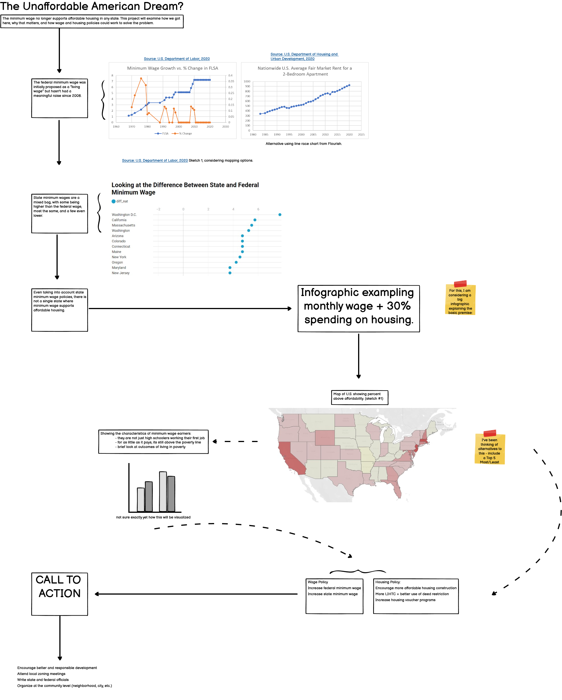

# Mini Project - Summary and Outline

## Project Summary:

The minimum wage no longer supports affordable housing in any state. This project will examine how we got here, why that matters, and how wage and housing policies could work to solve the problem.

## Project Outline and Structure:

All sketches and images below are just that - sketches - and subject to significant revision.

The basic structure will start by introducing the main concept - the U.S. proposed a federal minimum wage as a living wage, yet raises in the minimum wage haven't kept up with rising housing costs. In this case, housing costs are defined by U.S. Department of Housing and Urban Development's Fair Market Rent (FMR) formula. In the aggregate, this will look at the national average FMR for a 2-bedroom apartment and at the individual state level.

Because Fair Market Rent values are not the same in each state, we will briefly look at states with higher and lower state minimum wages compared to the federal minimum wage.

Even when taking into account differences in state and federal minimum wages, no state currently supports affordable housing. In this case affordable housing is defined as spending 30% of your monthly income on housing costs.

Currently I have a map from tableau looking at which states are the most unaffordable and the least unaffordable, but this is subject to change. I was also considering looking at a Top 5 Most/Least Unaffordable States.

From there, the project would examine who are typically minimum wage workers, and our conceptions of those demographics.

Lastly there is an examination of policy proposals for both wage and housing policies that could help remedy this issue.

## Call to Action:

The call to action in this case is multipronged. There is encouraging local, state, and federal office holders to increase minimum wage polices - attending local housing/zoning meetings to encourage more sustainable development - and to participate in local organizing efforts in your neighborhood or community.

## User Research and Feedback

#### Target Audience:

Middle-class, educated people who are less likely to have worked a minimum wage job (outside of high school/college) or have lived the effects of poverty. This audience, I believe, would be most impacted by learning about the challenges of some of the most vulnerable Americans.

#### Approach to Targeting Interviewees:

Finding people to interview might be more difficult in the current climate, but I believe that many friends, family members, and classmates would fit the description.

#### Interview Script:

1.	How familiar are you with the minimum wage? Affordable housing?
2.	An individual working a full time minimum wage job makes roughly $15k a year. Do you think that is above or below the poverty line? (it is above - $12,760)
3.	What characteristics would you use to describe a minimum wage worker?
4.	What do you think is the average fair market rent for a two bedroom apartment is in your state/nationwide? (read figure to them)
5.	Do you think that is affordable? If not,
a.	If you could quantify the cost of affordable housing what would it be?
6.	Show draft visualizations – ask what the like/dislike, if confusing, etc.
7.	Ask what policies would they be willing to support to address housing affordability issues.

#### Interview Results:

###### Individual #1:

###### Individual #2:

###### Individual #3:

## Data Availablilty:

All data in this project is publicly avaliable, made by U.S. federal agencies. This includes:

 - [1] [U.S. Bureau of Labor and Statisitics - Characteristics of Minimum Wage Workers](https://www.bls.gov/opub/reports/minimum-wage/2019/home.htm)
 - [2] [U.S. Department of Labor - Minimum Wage History](https://www.dol.gov/agencies/whd/state/minimum-wage/history)
 - [3] [U.S. Department of Housing and Urban Development - Fair Market Rent History](https://www.huduser.gov/portal/datasets/fmr.html#history)
 - [4] [U.S. Department of Labor - Median Weekly Earnings of Full Time Workers](https://www.bls.gov/webapps/legacy/cpswktab3.htm)

[1] Characteristics of Minimum Wage Workers - used to describe the general characteristics of workers, mostly to correct misconceptions about minimum wage workers. Most minimum wage earners are above the age of the age of 25, and have at least a high school diploma.

[2] Minimum Wage History - used to create charts related to minimum wage history over time, and current values of state minimum wages. Anything that references minimum wage levels references these tables.

[3] Fair Market Rent History - used to create anything related to mapping average rent values for apartments in the U.S. This includes both creating a national average, state average, and county level (using FIPS) data, and dates back to 1983. Fair Market Rent is calculated by HUD, and is available for 0, 1, 2, 3, and 4 bedroom apartments. Recent analysis of affordable housing tend to focus on the 2-bedroom apartments as the benchmark.

[4] Median Weekly Earnings - currently not being used in the wireframe, but may be informative in explaining the gap between earnings and affordable housing.
