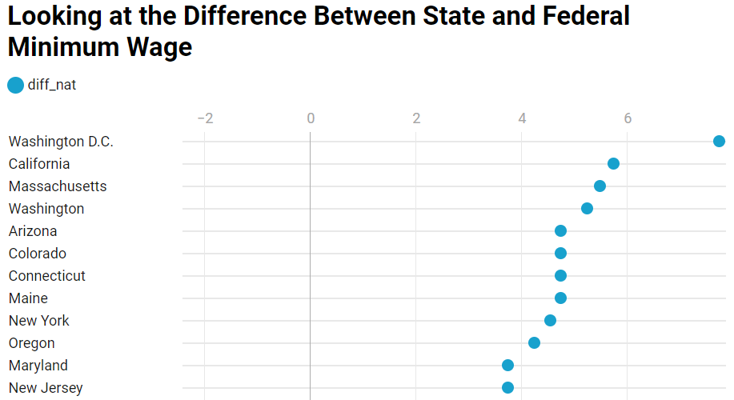
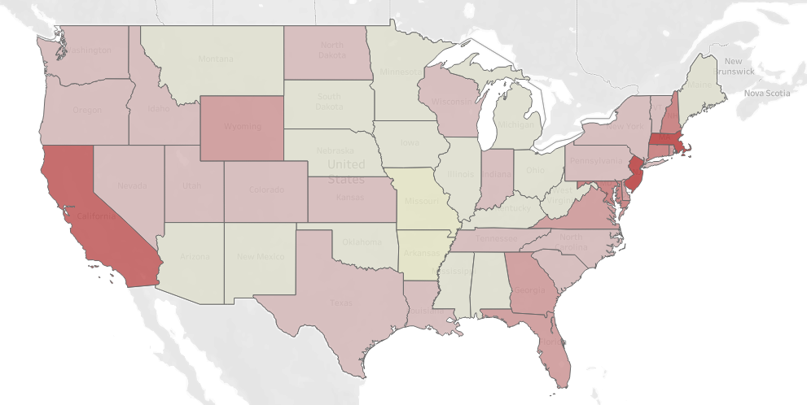

# Mini Project Part 2 - Revisions, Deliverables, and Final Presentations

## New Wireframe:

## Project Revisions:

The original scope of the project was to look at how the minimum wage no longer supplied affordable housing in any state.

#### Layout Revisions:

Based on the feedback that I recieved from part one of the mini-project, I decided to change the general layout of my presentation and website. My original wireframe went from

      1. Explaining wage policy ->
      2. Looking at state/federal minimum wage differences ->
      3. Examining maps of affordability ->
      4. Examining characteristics of minimum wage workers ->
      5. Recommendations and call to action
      
While I thought this would be a reasonable start, what I found was that looking at the characteristics of minimum wage workers wasn't as compelling a reason to some of my audience members. Instead of focusing on a narrow segment of the workforce, why not look at the average workers' wage was their suggestion. This required a new layout and new visualizations in my project. The new wireframe, as shown above now goes:

      1. Examining housing costs ->
      2. Looking at what is considered affordable housing ->
      3. History of the federal minimum wage ->
      4. Looking at differences in state minimum wages ->
      5. Example of how all states are unaffordable at minimum wages ->
      6. Considering affordability in the context of average wages ->
      7. Example of how some states are unaffordable to the average workers' wage ->
      8. Recommendations and call to action
      
This required a lot of new datasets and visualizations. While the new layout and framework is considerably longer, I believe it creates a better narrative and better flow for presentation that will ultimately be a higher quality presentation.

#### Graphic visualizations:

One of the more helpful suggestions from my interviewee's were related to the visualizations. While they understood some of the graphics easily, others required too much of an explaination for them to be helpful.

An example would be the picture below:

This was meant to show which states were above/below the federal minimum wage, with $7.25 being 0 on the scale. With explaination I could show that Washington D.C. was ay $15/hr, or $7.75 above the federal minimum wage - but it wasn't very quick or intuitive. Instead, I turned it into a color-coded tableau page, where you could visually see which states were higher (blue) than the federal wage, and which were lower (red). You can also hover over individual states to see what their minimum wage is specifically.

<noscript></noscript><object class='tableauViz'  style='display:none;'><param name='host_url' value='https%3A%2F%2Fpublic.tableau.com%2F' /> <param name='embed_code_version' value='3' /> <param name='site_root' value='' /><param name='name' value='MinimumWagebyState_15958742828010&#47;Sheet1' /><param name='tabs' value='no' /><param name='toolbar' value='yes' /><param name='static_image' value='https:&#47;&#47;public.tableau.com&#47;static&#47;images&#47;Mi&#47;MinimumWagebyState_15958742828010&#47;Sheet1&#47;1.png' /> <param name='animate_transition' value='yes' /><param name='display_static_image' value='yes' /><param name='display_spinner' value='yes' /><param name='display_overlay' value='yes' /><param name='display_count' value='yes' /><param name='language' value='en' /></object>

Another example would be the affordability map from the original framework. I tried to show with a scale from green to red that all states were unaffordable. But again, having to verbally explain the colors, and that no state was affordable meant that I was spending just as much time explaining the visualization as a I was explaining the concepts behind them. Therefore the picture went from this:

To this chart below:

<iframe title="No State Has Affordable Housing" aria-label="Range Plot" id="datawrapper-chart-qDIRF" src="https://datawrapper.dwcdn.net/qDIRF/5/" scrolling="no" frameborder="0" style="border: none;" width="595" height="1029"></iframe>

#### New Visualizations:

Similar to the reworked minimum wage affordability chart above, I made a new chart looking at how the average workers' wage stacks up against what is considered affordable. I thought putting in the same style as the previous chart, but with a new color for the average wage and reusing the same color for the affordability wage would be helpful for the reader/audience members.

<iframe title="Affordability is a Mixed Bag" aria-label="Range plot" id="datawrapper-chart-PfQK0" src="https://datawrapper.dwcdn.net/PfQK0/3/" scrolling="no" frameborder="0" style="border: none;" width="595" height="1029"></iframe>

## Shorthand Page:

## Final Story:

## References:
