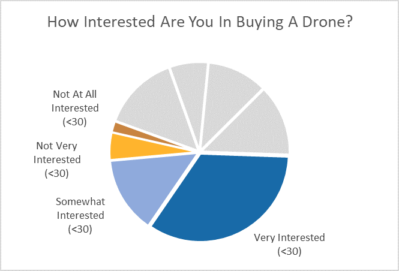
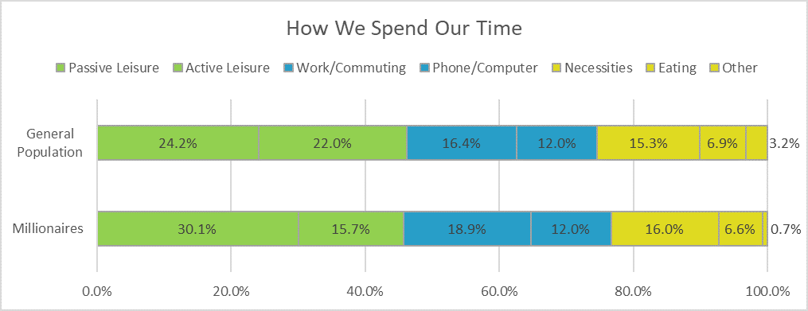

# Additional Sketches by Week

#### Week 1:

Sketches from The Good Charts Workbook:

#### Week 2:

Sketches from The Good Charts Workbook:

#### Week 3:

Sketches from The Good Charts Workbook:

#### Week 4:

Sketches from The Good Charts Workbook:

